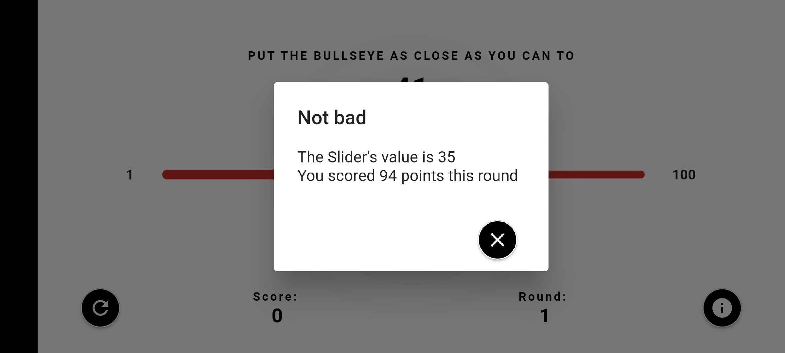
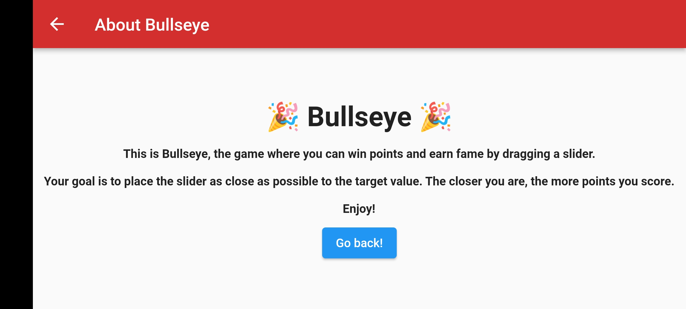

# kodeco Flutter Learning

This repository contains flutter projects build and redesign, which is part of Kodeco Flutter Learning path's course material. 

## First app: [Bullseye-Blaster](https://github.com/Akash4097/kodeco_flutter_learning/tree/main/lib/flutter_learning_path/bullseye) 
### This is Bullseye, the game where you can win points and earn fame by dragging a slider

 
 

## Second app: [Kodeco-App](https://github.com/Akash4097/kodeco_flutter_learning/tree/main/lib/flutter_learning_path/kodeco_app) 
### This is [Raywenderlich](https://www.kodeco.com) app from the [course](https://www.kodeco.com/25841733-your-second-flutter-app), made some design changes...

 
 

### Listing All the course fetched from Rawenderlich(Kodeco) rest-api 

<section>

---

### showing detail of selected course.

<section>

---

### Applying filters using various course-category. 

<section>

